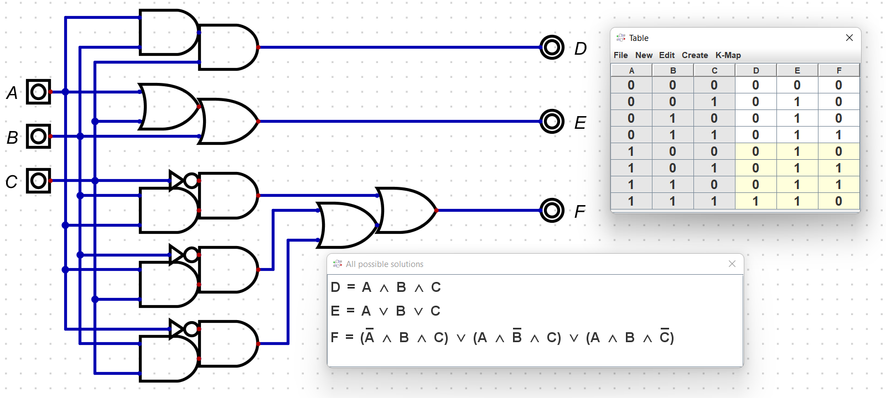
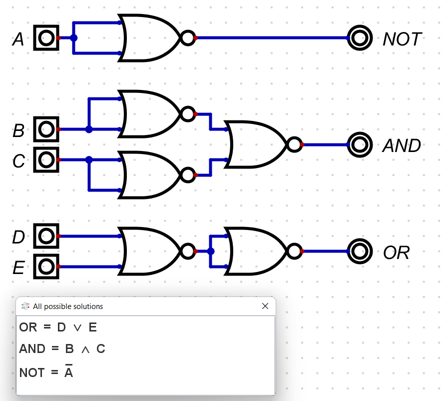
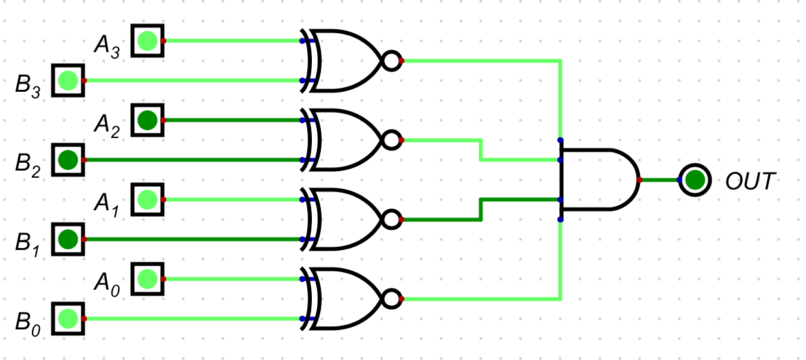
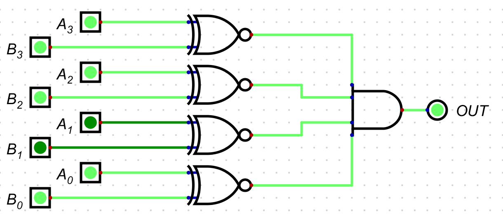
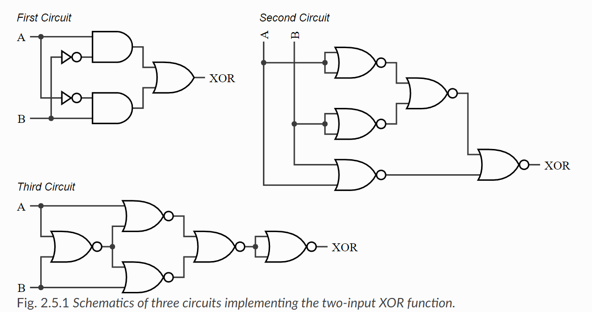
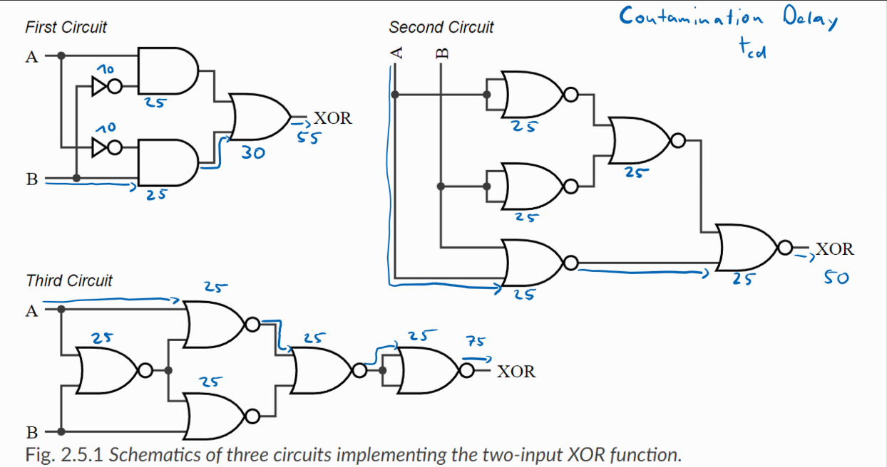
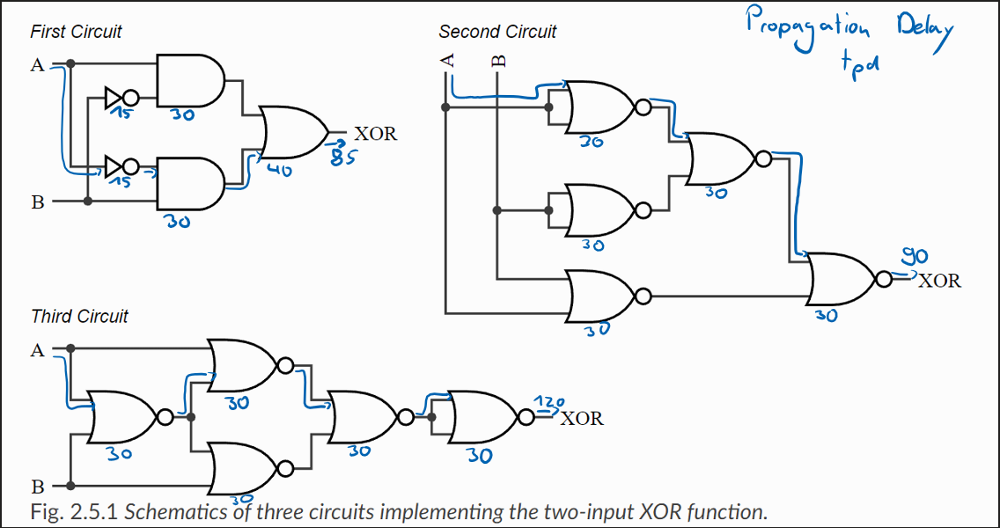

= Submission # 2
:stem: latexmath

== 2.2

=== 2.2.1

[cols="1,1,1,1,1,1"]
|===
| A | B | C | D | E | F
| 0 | 0 | 0 | 0 | 0 | 0
| 0 | 0 | 1 | 0 | 1 | 0
| 0 | 1 | 0 | 0 | 1 | 0
| 0 | 1 | 1 | 0 | 1 | 1
| 1 | 0 | 0 | 0 | 1 | 0
| 1 | 0 | 1 | 0 | 1 | 1
| 1 | 1 | 0 | 0 | 1 | 1
| 1 | 1 | 1 | 1 | 1 | 0
|===
=== 2.2.2

latexmath:[D(A,B,C) = A \cdot B \cdot C] +
latexmath:[F(A,B,C) = A + B + C] +
latexmath:[F(A,B,C) = A \cdot B \cdot \overline{C} + A \cdot \overline{B} \cdot C + \overline{A} \cdot B \cdot C] +

=== 2.2.3

=== 2.2.4

siehe 2.2.3

== 2.3

=== 2.3.1

not: latexmath:[\overline{a+a} = \overline{a}] +
and: latexmath:[\overline{\overline{a+a}\+\overline{b+b}} = \overline{\overline{a}+\overline{b}} = a \cdot b] +
or: latexmath:[\overline{\overline{a+b}+\overline{a+b}} = \overline{\overline{a+b}} = a+b] +

=== 2.3.2

== 2.4

== 2.5

[cols="1,1,1"]
|===
| Gate | t~cd~ | t~pd~
| NOT | 10 ps | 15 ps
| AND | 25 ps | 30 ps
| OR | 30 ps | 40 ps
| NOR | 25 ps | 30 ps
|===

=== 2.5.1

The First Circuit has the shortest propagation delay and therefore the best suited.