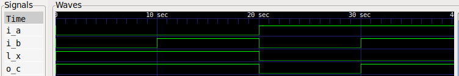
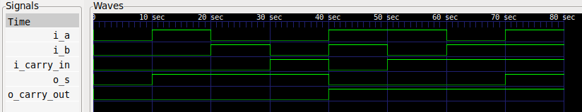
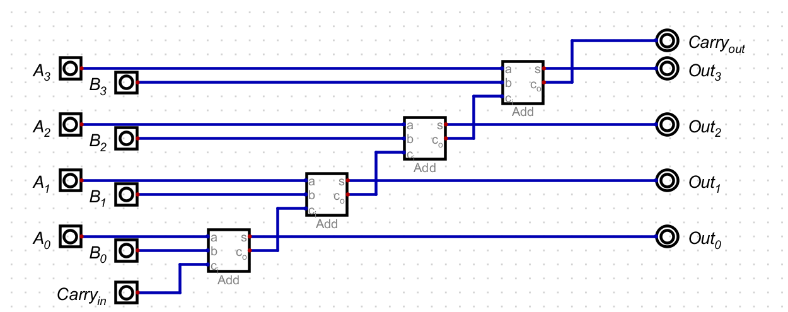
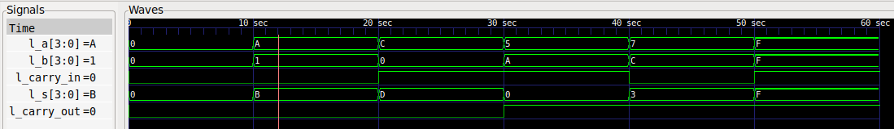
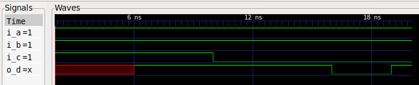

=== 3 Gate-level Modeling
:hardbreaks-option:

==== 3.1 My First Module

===== 3.1.3 Wave Visualisation

==== 3.2 Full Adder

===== 3.2.3 Wave Visualisation

==== 3.3 Four-bit Ripple-Carry Adder

===== 3.3.1 Schematik

===== 3.3.2 Combinations

inputs: 2 x 4-bit numbers + 1-bit c~in~
each bit can either be 0 or 1
total 9 bits with 2 options each
2^9^ = 512 possible inputs

in a 32-bit ripple-carry adder, there are 2 x 32 bit numbers + 1 bit c~in~
each bit can either be 0 or 1
total 65 bits with 2 options each
2^65^ = 37*10^18^ possible inputs

===== 3.3.3 Truthtable

[cols="1,1,1,1,1"]
|===
| A~[3:0]~ | B~[3:0]~ | C~in~ | S~[3:0]~ | C~out~
| 0000 | 0000 | 0 | 0000 | 0
| 1010 | 0001 | 0 | 1011 | 0
| 1100 | 0000 | 1 | 1101 | 0
| 0101 | 1010 | 1 | 0000 | 1
| 0111 | 1100 | 0 | 0011 | 1
| 1111 | 1111 | 1 | 1111 | 1
|===

===== 3.3.6 Wave Visualisation

==== 3.5 Delays

===== 3.5.2 Wave Visualisation

Glitch um 18 ns drum herum