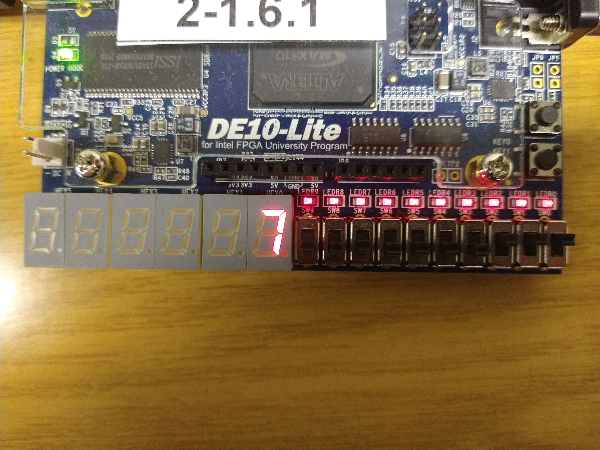
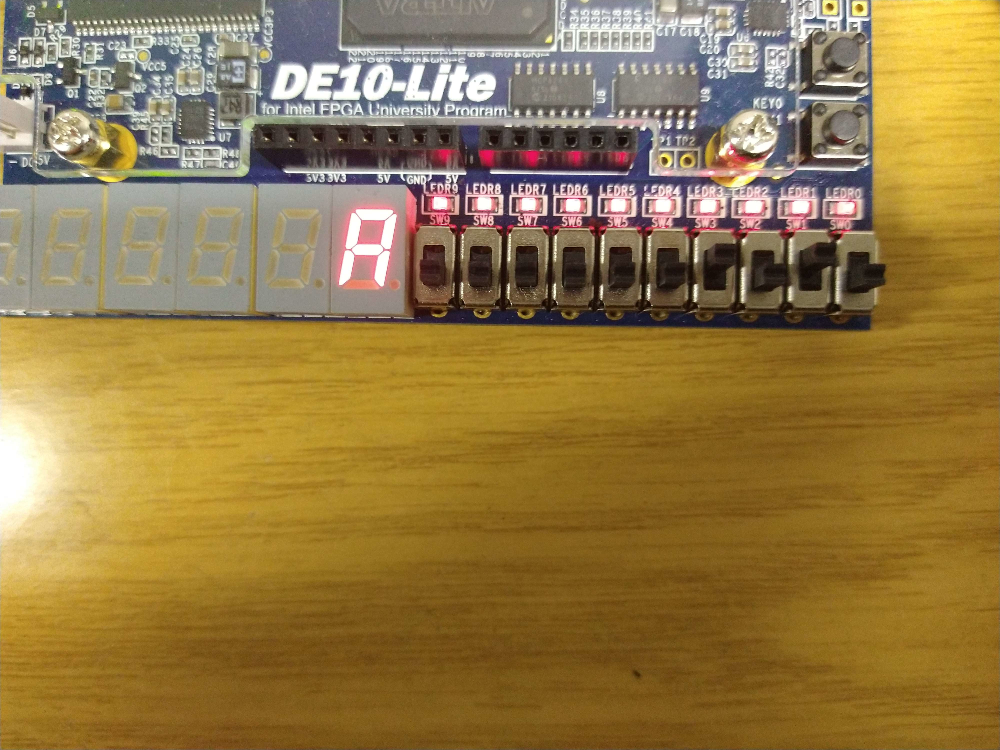
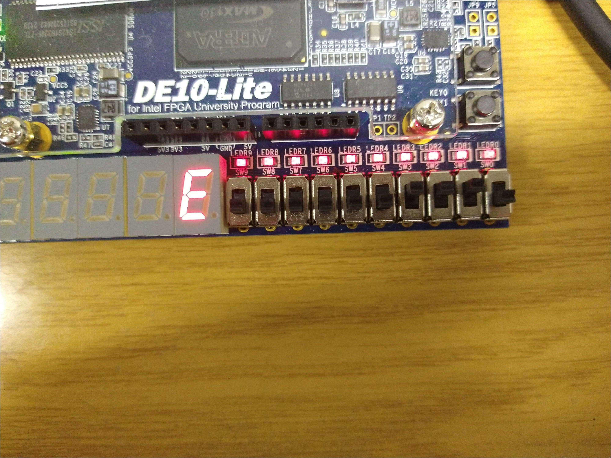
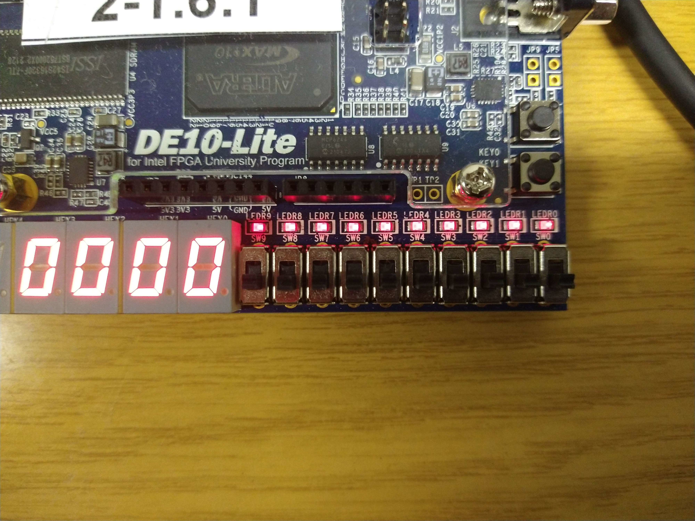
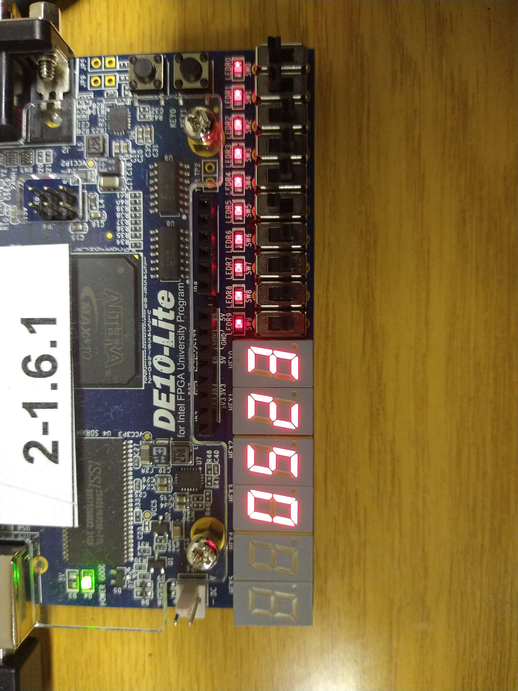
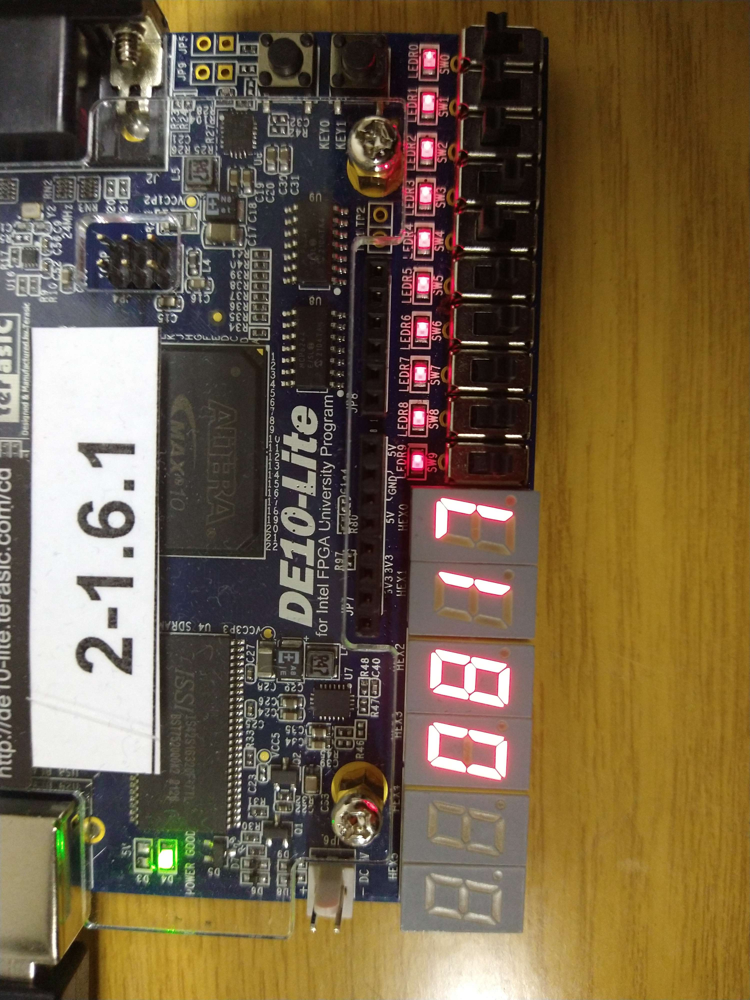
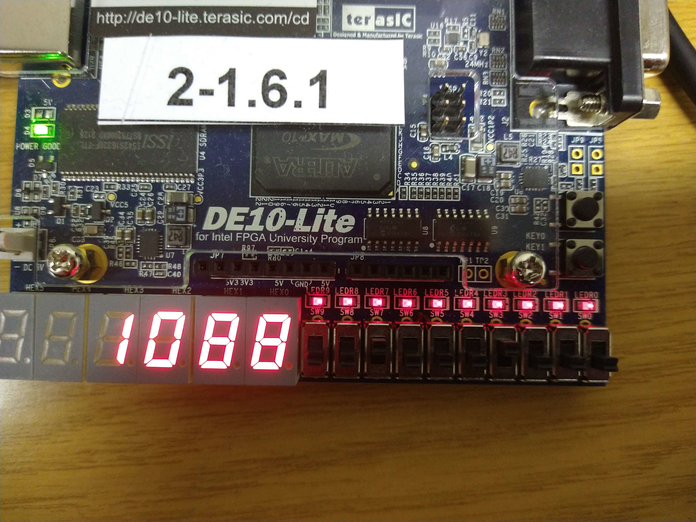
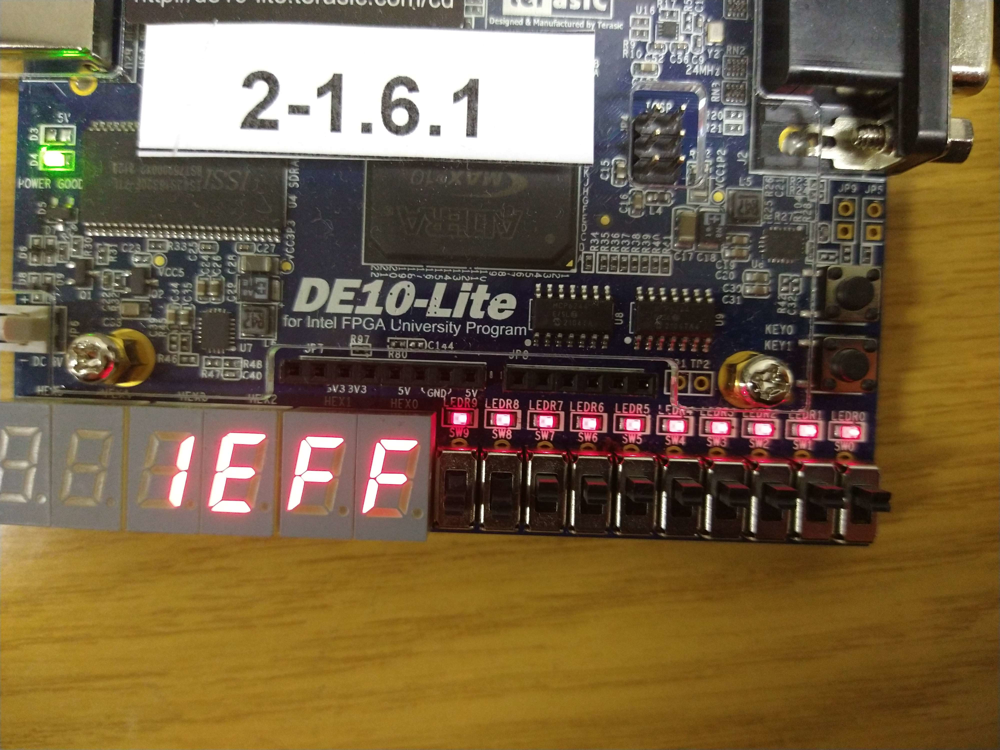

=== Submission 4
[%hardbreaks]

==== 4.2

===== 4.2.1

|===
| Hex Number | SW[3:0] | HEX0[6:0] | Base16
| 0 | 4'b0000 | 7'b100_0000 | 0x40
| 1 | 4'b0001 | 7'b111_1001 | 0x79
| 2 | 4'b0010 | 7'b010_0100 | 0x24
| 3 | 4'b0011 | 7'b011_0000 | 0x30
| 4 | 4'b0011 | 7'b001_1001 | 0x19
| 5 | 4'b0101 | 7'b001_0010 | 0x12
| 6 | 4'b0110 | 7'b000_0010 | 0x02
| 7 | 4'b0111 | 7'b111_1000 | 0x78
| 8 | 4'b1000 | 7'b000_0000 | 0x00
| 9 | 4'b1001 | 7'b001_0000 | 0x10
| A | 4'b1010 | 7'b000_1000 | 0x08
| B | 4'b1011 | 7'b000_0011 | 0x03
| C | 4'b1100 | 7'b100_0110 | 0x46
| D | 4'b1101 | 7'b010_0001 | 0x21
| E | 4'b1110 | 7'b000_0110 | 0x06
| F | 4'b1111 | 7'b000_1110 | 0x0E
|===

===== 4.2.5

==== 4.3

===== 4.3.4

