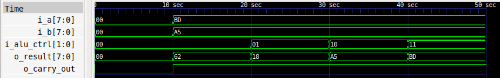
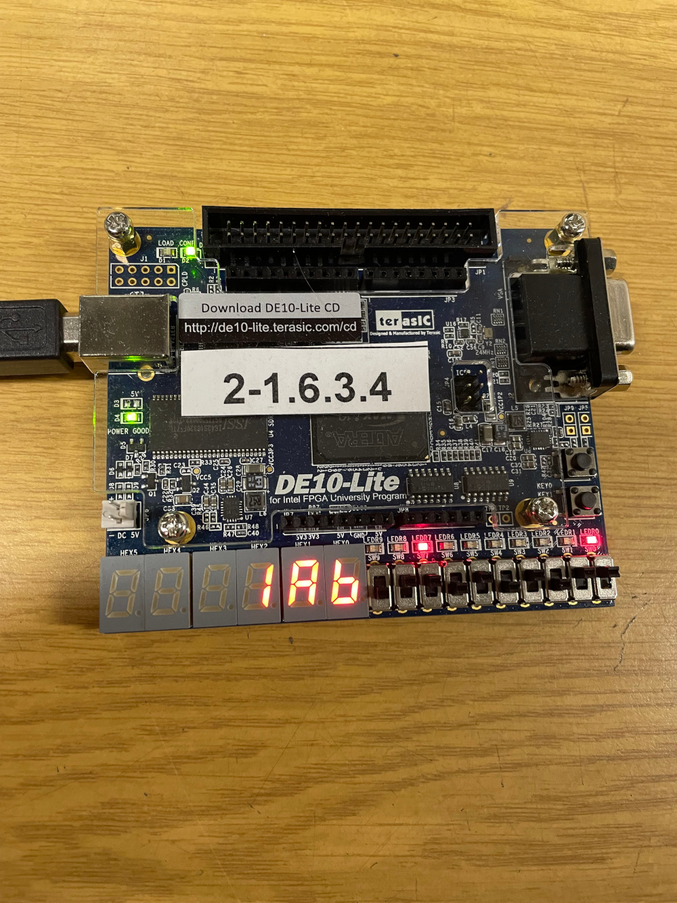
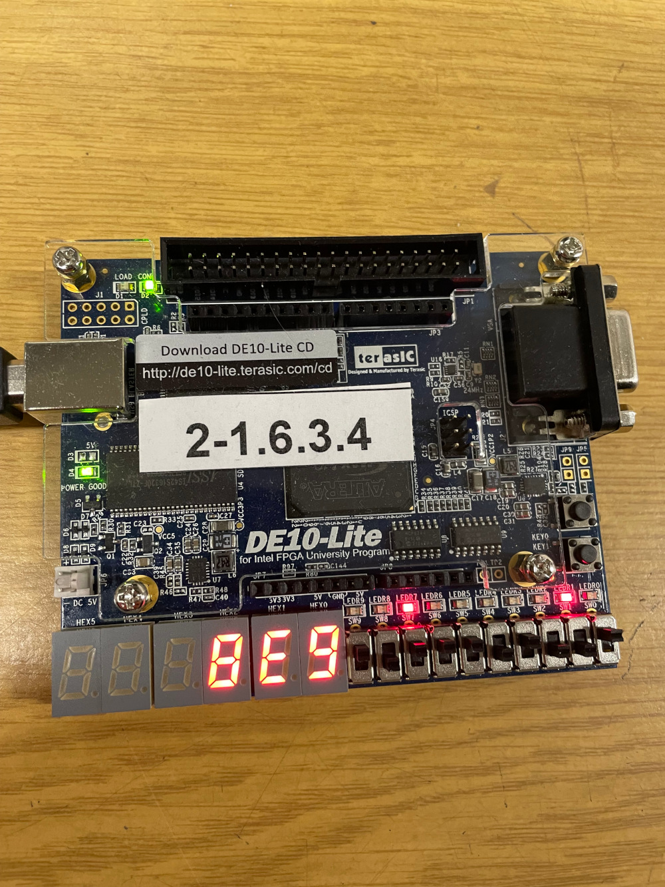
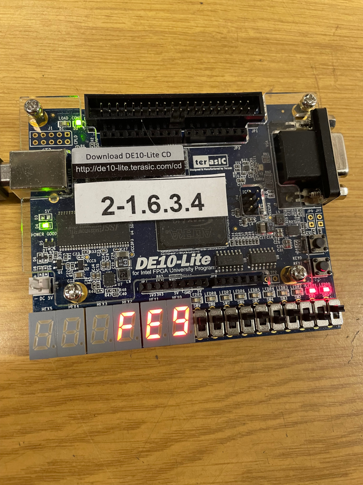
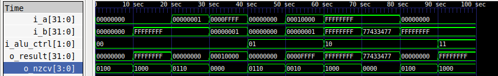
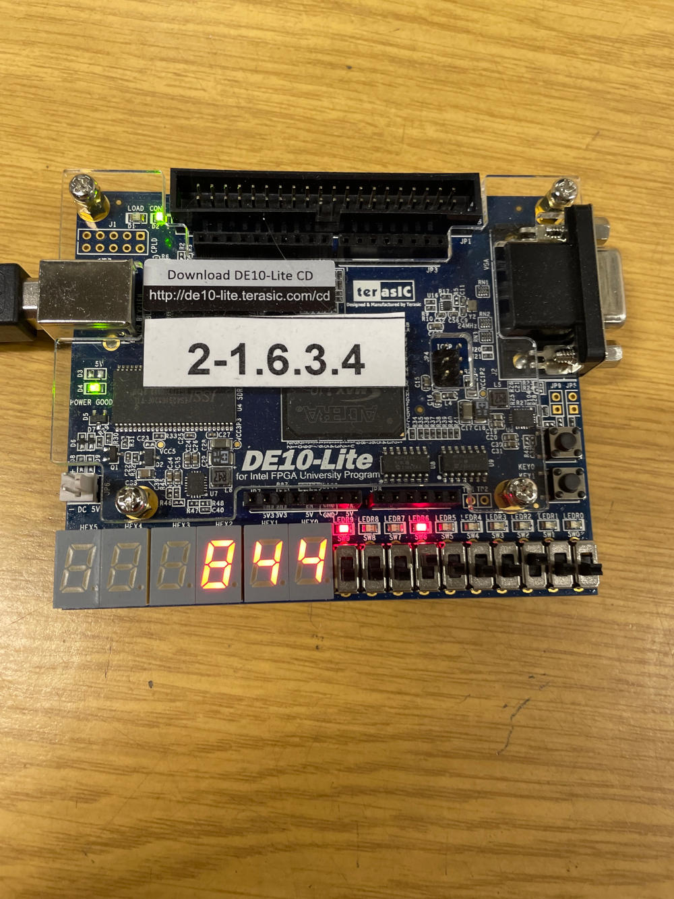
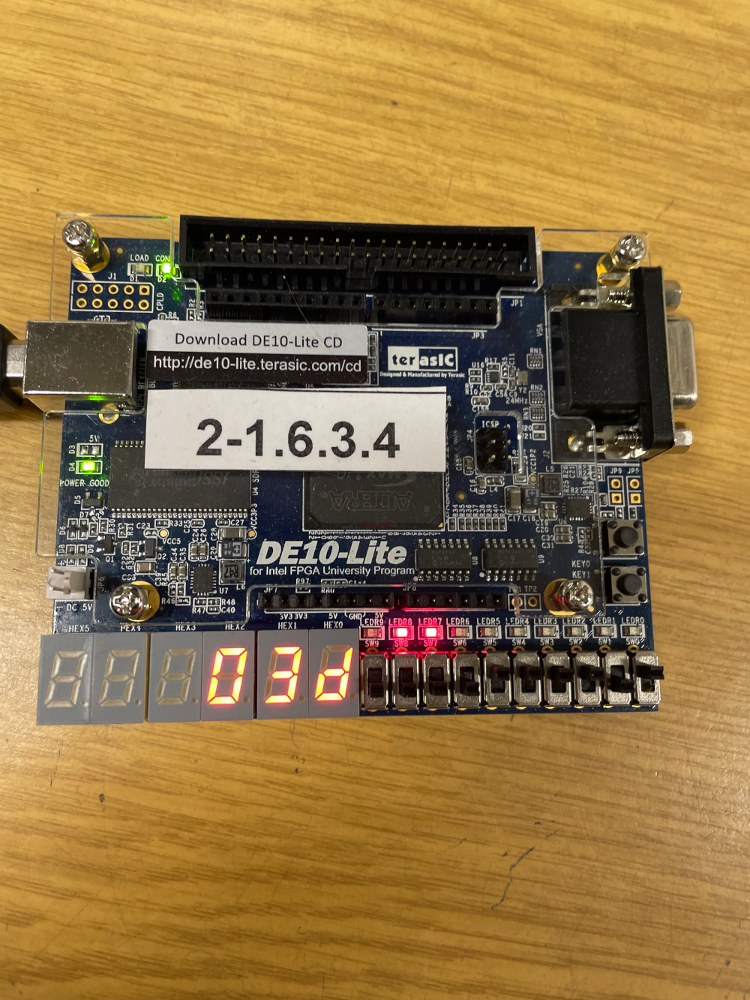
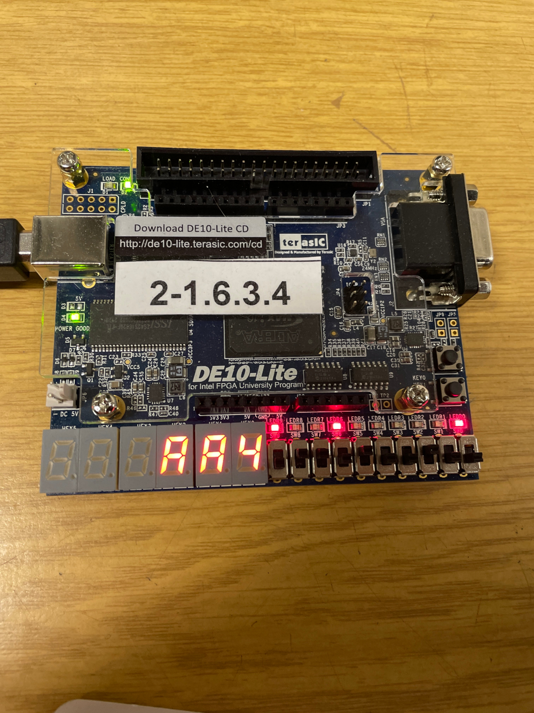
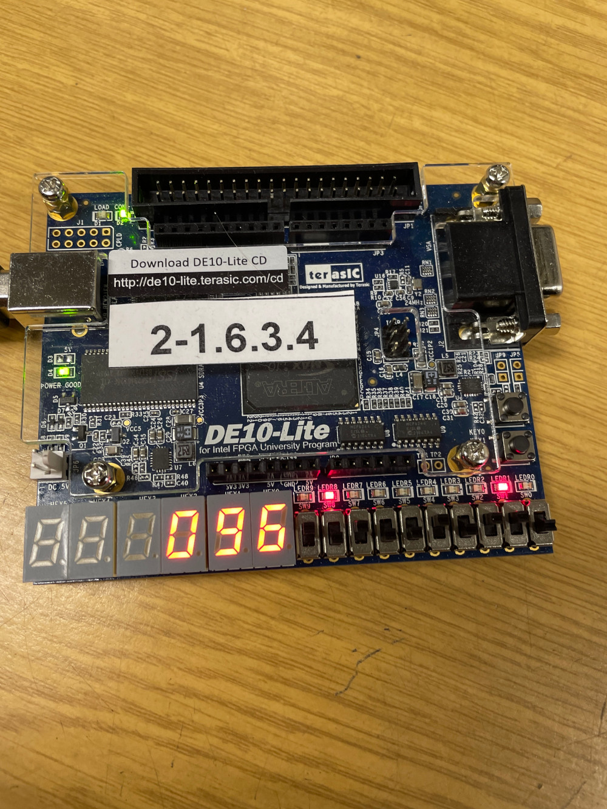
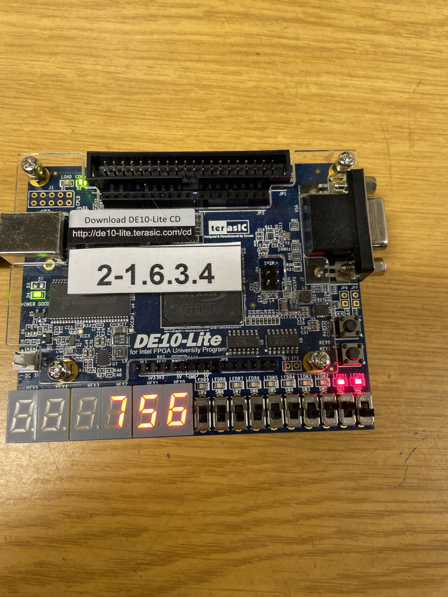

== Submission 5
:hardbreaks-option:

=== 5.1.1
|===
| i_a | i_b | i_alu_ctrl | o_result | o_carry_out
| 8'b0000_0000 | 8'b0000_0000 | 2'b00 | 8'b0000_0000 | 1'b0
| 8'b1011_1101 | 8'b1010_0101 | 2'b00 | 8'b0110_0010 | 1'b1
| 8'b1011_1101 | 8'b1010_0101 | 2'b01 | 8'b0001_1000 | 1'b1
| 8'b1011_1101 | 8'b1010_0101 | 2'b10 | 8'b1010_0101 | 1'b1
| 8'b1011_1101 | 8'b1010_0101 | 2'b11 | 8'b1011_1101 | 1'b1
|===

=== 5.1.3

=== 5.2.3

image::23AluAdd.jpg[ALU Add]

=== 5.3.2

|===
| i_a | i_b | i_alu_ctrl | o_result | o_nzcv
|32'h0000_0000 | 32'h0000_0000 | 2'b00 | 32'h0000_0000 | 4'b0100
|32'h0000_0000 | 32'hffff_ffff | 2'b00 | 32'hffff_ffff | 4'b1000
|32'h0000_0001 | 32'hffff_ffff | 2'b00 | 32'h0000_0000 | 4'b0110
|32'h0000_ffff | 32'h0000_0001 | 2'b00 | 32'h0001_0000 | 4'b0000
|32'h0000_0000 | 32'h0000_0000 | 2'b01 | 32'h0000_0000 | 4'b0110
|32'h0001_0000 | 32'h0000_0001 | 2'b01 | 32'h0000_ffff | 4'b0010
|32'hffff_ffff | 32'hffff_ffff | 2'b10 | 32'hffff_ffff | 4'b1000
|32'hffff_ffff | 32'h7743_3477 | 2'b10 | 32'h7743_3477 | 4'b0000
|32'h0000_0000 | 32'hffff_ffff | 2'b10 | 32'h0000_0000 | 4'b0100
|32'h0000_0000 | 32'hffff_ffff | 2'b11 | 32'hffff_ffff | 4'b1000
|===

=== 5.3.3

=== 5.4.1

|===
| Raw (bits) | Unsigned | Signed (two's complement)
| 0000~2~ | 0~10~ | 0~10~
| 0001~2~ | 1~10~ | 1~10~
| 0010~2~ | 2~10~ | 2~10~
| 0011~2~ | 3~10~ | 3~10~
| 0100~2~ | 4~10~ | 4~10~
| 0101~2~ | 5~10~ | 5~10~
| 0110~2~ | 6~10~ | 6~10~
| 1000~2~ | 8~10~ | -(2^3^-0) = -8~10~
| 1001~2~ | 9~10~ | -(2^3^-1) = -7~10~
| 1010~2~ | 10~10~ | -(2^3^-2) = -6~10~
| 1101~2~ | 13~10~ | -(2^3^-5) = -3~10~
|===

=== 5.4.2

|===
| i_a | i_b | i_alu_ctrl | o_result | o_nzcv
| 4'b0100 | 4'b0100 | 2'b00 | 4'b1000 | 4'b1001
| 4'b1101 | 4'b0011 | 2'b00 | 4'b0000 | 4'b0110
| 4'b0100 | 4'b1010 | 2'b01 | 4'b1010 | 4'b1001
| 4'b0110 | 4'b1001 | 2'b10 | 4'b0000 | 4'b0100
| 4'b0110 | 4'b0101 | 2'b11 | 4'b0111 | 4'b0000
|===

unsigned integer:
n => no meaning
z => zero
c => overflow in addition / subtraction
v => no meaning

signed integer:
n => negative
z => zero
c => no meaning
v => overflow in addition / subtraction

=== 5.4.3

==== Addition

ADDS (immediate)
64-bit: ADDS <Xd>, <Xn|SP>, #<imm>{, <shift>}
32-bit: ADDS <Wd>, <Wn|WSP>, #<imm>{, <shift>}

==== Subtraction

SUBS (immediate)
64-bit: SUBS <Xd>, <Xn|SP>, #<imm>{, <shift>}
32-bit: SUBS <Wd>, <Wn|WSP>, #<imm>{, <shift>}

=== 5.5.3

