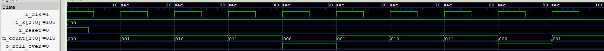
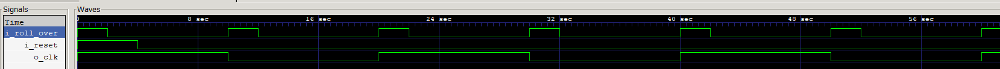

== Submission 7
:hardbreaks-option:

=== 7.1.2

=== 7.2.2

=== 7.2.3

50 MHz clock input

=== 7.2.4
2 Rollovers für einen Clock-Zyklus
Konvertieren von a nach b
a / b = 2 * Anzahl Rollovers (2 Rollovers = 1 Zyklus in B)
a/b = 2 * k
k = a/(2*b)
a = 50 * 10^6^ Hz
b = 10 Hz: k_10 = 50 * 10^6^ / (2 * 10) = 2.5 * 10^6^
b = 1 Hz : k_1 = 50 * 10^6^ / (2 * 1) = 25 * 10^6^
b = 0.1 Hz : k_0_1 = 50 * 10^6^ / (2 * 0.1) = 250 * 10^6^