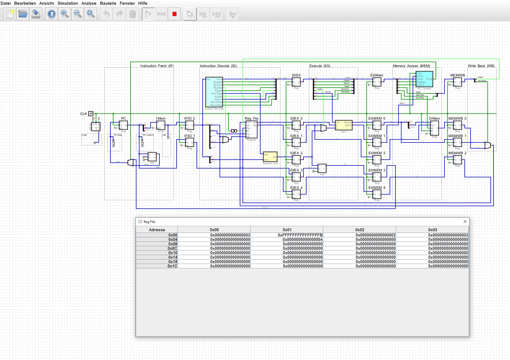
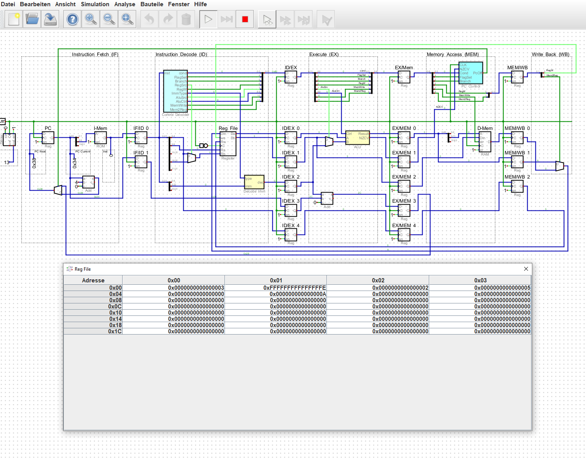
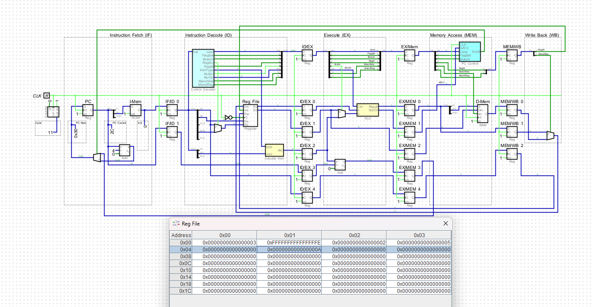
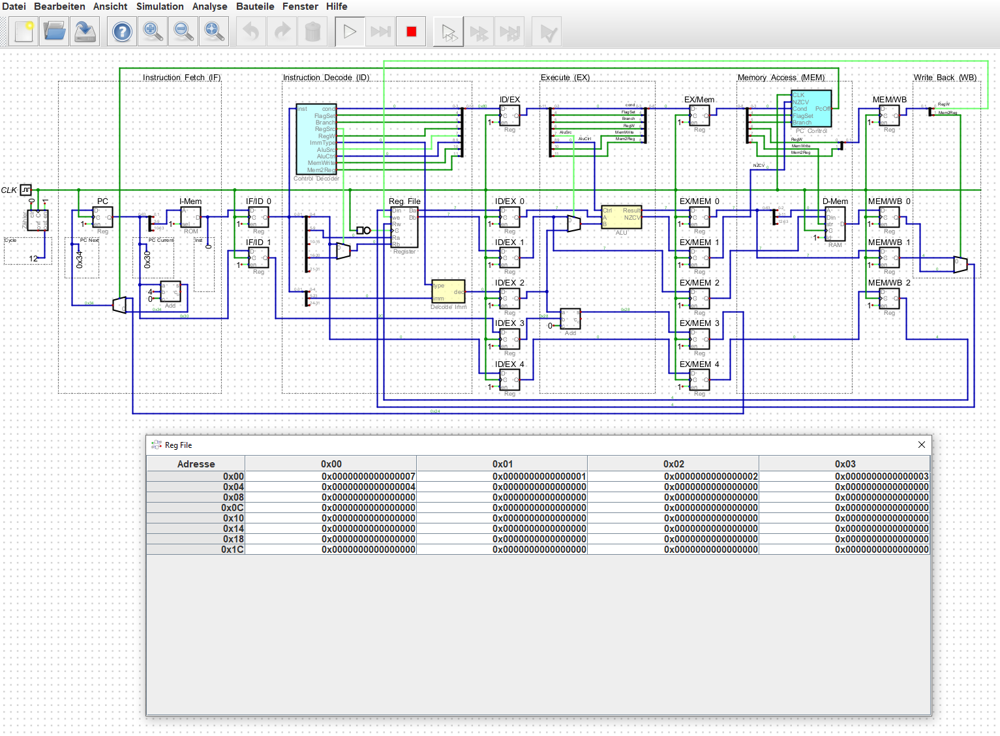
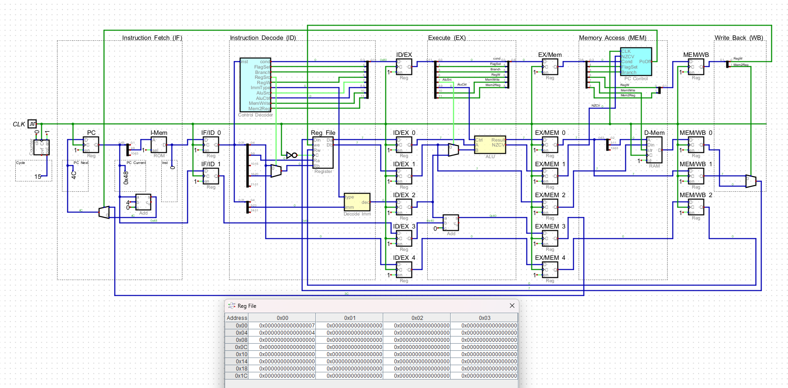

== Submission 13
:source-highlighter: rouge
:hardbreaks-option: true

=== 12.1

==== 12.1.1

-----
x0: 3, x1: - , x2: -, x3: -, x4: -, x5: -   //orr x0, xzr, #3
x0: 3, x1: -2, x2: -, x3: -, x4: -, x5: -   //sub x1, x0, #5
x0: 3, x1: -2, x2: 2, x3: -, x4: -, x5: -   //orr x2, xzr, #2
x0: 3, x1: -2, x2: 2, x3: 5, x4: -, x5: -   //add x3, x2, x0
x0: 3, x1: -2, x2: 2, x3: 5, x4: 0, x5: -   //and x4, xzr, x4
x0: 3, x1: -2, x2: 2, x3: 5, x4: 0, x5: 10  //add x5, x0, #7
-----

==== 12.1.2

==== 12.1.3

[source,armasm]
-----
orr x0, xzr, #3
nop
nop
sub x1, x0, #5
orr x2, xzr, #2
nop
nop
add x3, x2, x0
and x4, xzr, x4
add x5, x0, #7
-----

==== 12.1.4

[source,armasm]
-----
orr x0, xzr, #3
orr x2, xzr, #2
and x4, xzr, x4
add x5, x0, #7
add x3, x2, x0
sub x1, x0, #5
-----

=== 12.2

==== 12.2.1

-----
x0: 7, x1: - , x2: -, x3: -, x4: -  //orr x0, xzr, #7
x0: 7, x1: - , x2: -, x3: -, x4: -  //nop
x0: 7, x1: - , x2: -, x3: -, x4: -  //nop
x0: 7, x1: - , x2: -, x3: -, x4: -  //subs xzr, x0, #5
x0: 7, x1: - , x2: -, x3: -, x4: -  //b.ne #16
//die ersten 3 orr's werden übersprungen
x0: 7, x1: - , x2: -, x3: -, x4: 4  //orr x4, xzr, #4
-----

==== 12.2.2

==== 12.2.3

[source,armasm]
-----
orr x0, xzr, #7
nop
nop
subs xzr, x0, #5
b.ne #28 //16 + 3 * 4 für nop's
nop
nop
nop
orr x1, xzr, #1
orr x2, xzr, #2
orr x3, xzr, #3
orr x4, xzr, #4
-----

=== 12.3

==== 12.3.1

For example, if there is a sequence of instructions that include a memory load instruction followed by an arithmetic instruction.
An in-order core will have to wait for the memory load instruction to complete before it can execute
the arithmetic instruction, resulting in the pipeline stall. An out-of-order core like Cortex-A72 
can execute the arithmetic instruction while the memory load instruction is in progress, which can reduce the stall time, and improve performance.

==== 12.3.2

Pipeline: Multi-Cycle Pipeline
1.5 MRD MADD Instruktionen pro Sekunde (throughput per cycle = 1; GHZ = 1,5)

==== 12.3.3

-----
running aarch64 microbenchmarks
micro_aarch64_madd_w_independent
  repetitions: 299514331
  duration: 9.02812 seconds
  GInstructions: 0.497636
finished aarch64 microbenchmarks
-----

==== 12.3.4

execution latency: 3 (1)
instructuions latency read after write: 3
500 MIO MADD Instruktionen pro Sekunde (throughput per cycle = 1; GHZ = 1,5, latency 3)

==== 12.3.5

-----
running aarch64 microbenchmarks
micro_aarch64_madd_w_independent
  repetitions: 290609004
  duration: 8.82879 seconds
  GInstructions: 0.493741
micro_aarch64_madd_w_raw_rn
  repetitions: 330933207
  duration: 11.1115 seconds
  GInstructions: 0.446746
finished aarch64 microbenchmarks
-----
