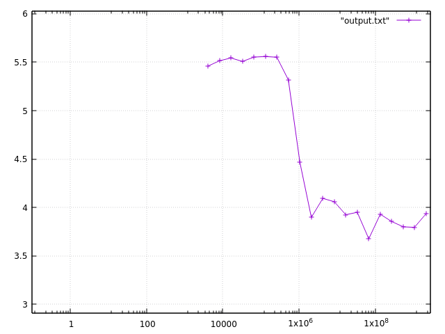

== Submission 14
:source-highlighter: rouge
:hardbreaks-option: true

=== 13.1.1

source: https://www.raspberrypi.com/documentation/computers/processors.html
It has a level 1 (L1) data cache of 32 kB and instruction cache of 48 kB and a level 2 (L2) cache of 1 MB.
The Cache Line Size is 64 bytes.

512
16384
524288
16777216
268435456

=== 13.1.2

-----
Size  Speed[GiB/s]
4096	5.45986
8192	5.51406
16384	5.54408
32768	5.50779
65536	5.55227
131072	5.55904
262144	5.55093
524288	5.31827
1048576	4.46576
2097152	3.89787
4194304	4.0941
8388608	4.05938
16777216	3.92463
33554432	3.95015
67108864	3.676
134217728	3.9299
268435456	3.85435
536870912	3.80071
1073741824	3.79423
2147483648	3.93363
-----

=== 13.1.3

=== 13.2.1

Variant 1: 1s (Stride 1)
Variant 2: 2s (Stride 2), has to load everything twice
Variant 3: 4s (Stride 4), has to load everything four times
Variant 4: 8s (Stride 8), has to load everything eight times
Variant 5: 16s (Stride 16), has to load everything eight times because 8 x 16 = 128 > 64 => for each calculation a new cache line has to be loaded anyways

=== 13.2.2

-----
Dot product Distance 1: 
  error:             0
  time:              1.56538
  bandwidth (GiB/s): 0.638823
Dot product Distance 2: 
  error:             0
  time:              1.61336
  bandwidth (GiB/s): 0.619825
Dot product Distance 4: 
  error:             0
  time:              2.28909
  bandwidth (GiB/s): 0.436855
Dot product Distance 8: 
  error:             0
  time:              4.59681
  bandwidth (GiB/s): 0.217542
Dot product Distance 16: 
  error:             0
  time:              4.49131
  bandwidth (GiB/s): 0.222652
-----

Hypothesis: We don't see a large decrepency between Method 1 and 2 because its able to prefetch the next cache line fast enough to not impact performance